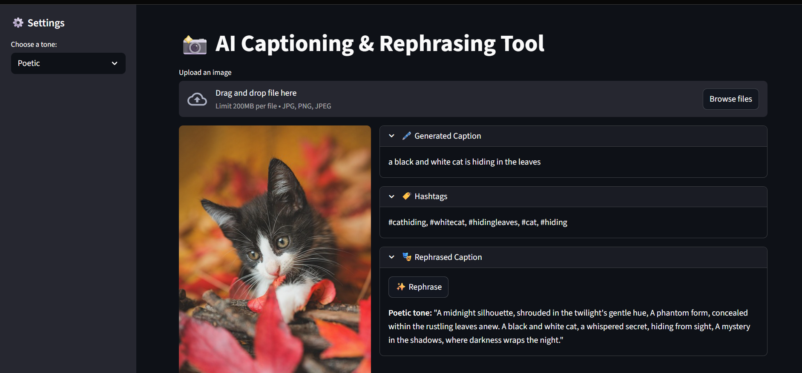

# 🖼️ AI Captioning & Rephrasing Tool

This project generates captions for images using **BLIP (Bootstrapped Language Image Pretraining)** and then rephrases them into different tones using **LLaMA 3.1**, with hashtag generation powered by **KeyBERT**.  
It also includes model evaluation on a mini COCO dataset subset, using **BLEU scores** for caption quality assessment.

---

## ✨App Preview


---

## 🚀 Live Demo

🎯 Try the live app here:  
👉 [**Hugging Face Demo**](https://huggingface.co/spaces/KhwaishK/CapTone)

---

## 📸 Features

- 🧠 **Automatic Image Captioning** using Salesforce BLIP model  
- 🏷️ **Hashtag Generation** using KeyBERT keyword extraction  
- ✍️ **Tone Rephrasing** with LLaMA 3.1 (Funny, Professional, Poetic, and Marketing/Ad tones)  
- 🧪 **Model Evaluation** on a mini COCO dataset with BLEU scores  
- 🖥️ **Streamlit Web App** for easy user interaction  

---

## 🧩 Project Structure
```graphql
📦 AI-Captioning-Rephrasing-Tool
│
├── app.py                     # Streamlit-based user interface
├── pipeline.py                # Core pipeline: captioning, hashtags, rephrasing
├── prepare_mini_dataset.py    # Script to create a mini COCO validation dataset
├── model_testing.py           # Evaluates BLIP model performance on mini dataset (BLEU)
│
├── data/
│   ├── annotations/           # COCO-style annotation JSONs
│   ├── mini_val2014/          # Subset of COCO validation images
│   └── samples/               # Sample images for testing
│
├── params.yaml                # Configuration for model paths, UI options, and parameters
├── requirements.txt           # Python dependencies
└── README.md
```

---

## ⚙️ Installation & Setup
### 1️⃣ Clone the repository 
```bash
git clone https://github.com/KhwaishK/CapTone.git
cd AI-Captioning-Rephrasing-Tool
```

### 2️⃣ Create a virtual environment
```bash
python -m venv captionenv
captionenv\Scripts\activate   # (Windows)
# OR
source captionenv/bin/activate  # (Mac/Linux)
```

### 3️⃣ Install dependencies
```bash
pip install -r requirements.txt
```
### ▶️ Running the App Locally
```bash
streamlit run app.py
```
Then open the provided local URL (usually http://localhost:8501) in your browser.

---

## ⚡ How It Works
1. **Image Upload** → User uploads an image (or uses default sample).
2. **Caption Generation** → BLIP model generates a natural caption.
3. **Hashtag Extraction** → KeyBERT extracts top keywords as hashtags.
4. **Tone Rephrasing** → User selects a tone and LLaMA 3.1 rewrites the caption accordingly.

---

## 📊 Model Evaluation (Optional)
To evaluate BLIP performance on the mini COCO dataset:
```bash
python model_testing.py
```
- Computes BLEU score between generated and ground-truth captions.
- Uses annotations from data/annotations and images from data/mini_val2014.
  
You can regenerate your mini subset using:
```bash
python prepare_mini_dataset.py
```

---
## ⚙️ Configuration (params.yaml)
Example structure:
```yaml
dataset:
  mini_val_dir: data/mini_val2014
  val_dir: data/val2014          # original COCO val2014 
  n_val: 50

evaluation:
  annotation_path: data/annotations/captions_val2014.json

caption:
  max_tokens: 30
  model_name: Salesforce/blip-image-captioning-base

hashtags:
  top_k: 5

llm:
  model_name: llama-3.1-8b-instant
  tones:
    - Funny
    - Professional
    - Poetic
    - Marketing/ Ad

ui:
  test_image: Data/samples/cat.jpg
```

---

## 🧠 Tech Stack
- **Transformers** – Hugging Face BLIP model for captioning
- **KeyBERT** – Keyword extraction for hashtags
- **Ollama (LLaMA 3.1)** – Tone-based rephrasing
- **Streamlit** – Interactive user interface
- **PyTorch, Pandas, Pillow, NLTK** – Core ML and evaluation utilities

---

## 📌 Planned Features
- Support for multiple image uploads
- Downloadable rephrased captions and hashtags
- More tone options (e.g., sarcastic, romantic, dramatic)
- Option to save results as .csv or .txt

---

## 🤝 Contributing
Pull requests are welcome! Feel free to open issues to suggest improvements or report bugs.

---

## 👩‍💻 Author
Khwaish Khandelwal
-AI/ML Enthusiast | Computer Vision | NLP | Data Science | 
[LinkedIn](https://www.linkedin.com/in/khwaish-khandelwal-543b9725a/) | [GitHub](https://github.com/KhwaishK)
